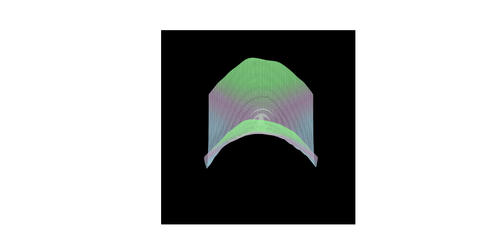
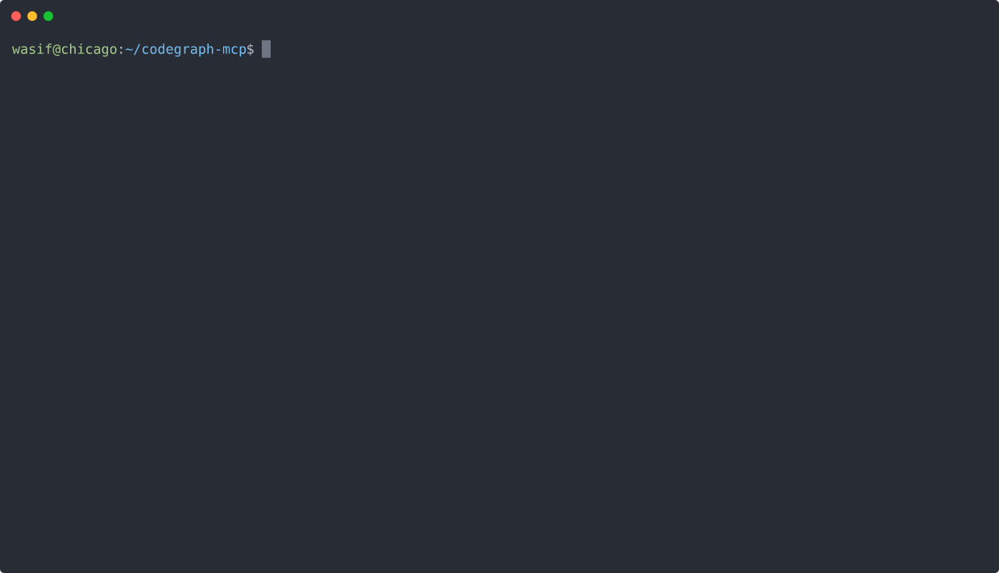

## 🪐 About Me

Hey! I'm Wasif, a self-taught software engineer & developer based in Chicago. 
I like building software that really challenges and interests me, while staying 
tasteful in design an UI/UX.

I'm motivated by the gap between what looks like it works and 
what actually does, and most of my projects exist to close that gap.

I enjoy systems work and applied infrastructure, I'm also drawn to 
lower-level problems when the higher-level abstraction is hiding something 
important. At the same time, I like building tools and apps that are on the 
cutting edge of tech, and have an actual impact.

Outside of building, I trade ES futures (six years in markets) and came up 
through cybersecurity work — SIEM, IAM, threat modeling. Both backgrounds 
shaped my journey extensively.

I'm currently pushing codegraph-mcp toward broader external testing, 
building Typai (an embeddable writing intelligence layer), and thinking 
hard about the deterministic bridges between AI intent and real-world 
infrastructure. I also have ambitious plans in quantitative finance, 
robotics, simulations, and the 3D realm.

| 🔮 Stochastic Systems Mapping | 💹 Live ES Futures Ticker |
| :---: | :---: |
|  |  |

## ⚙️ Execution: CodeGraph-MCP

## 🌐 Socials

## 📜 Certifications

## 💻 Tech Stack

